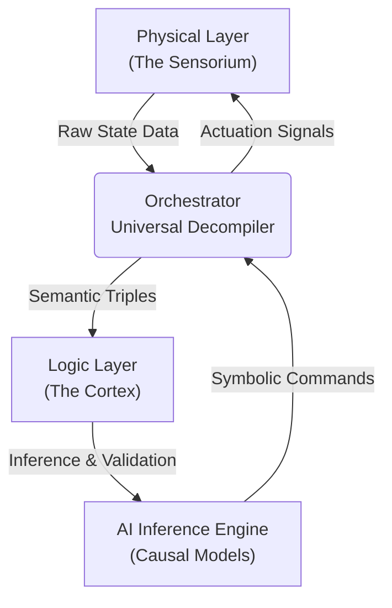

# Exocortex: Sovereign Cognitive Architecture

> **System Status:** Pre-Alpha / Architectural Definition
> **Substrate:** Localized Inference Node ("Exocortex")

## 1. Ontological Definition
The **Exocortex** is a **Sovereign Cognitive Architecture** designed to extend human cognition into the domestic environment. It functions as a homeostatic regulator, minimizing local entropy through the application of **Causal AI** and **Symbolic Logic**.

Unlike distinct "Smart Home" solutions that rely on cloud-based stochastic pattern matching, the Exocortex enforces **Data Sovereignty** and **Epistemological Grounding**. It bridges the gap between the chaotic data stream of physical reality and the rigid axioms of formal logic.

## 2. Architectural Topology

The system operates on a triadic architecture, ensuring a strict separation of concerns between sensing, reasoning, and acting.



### 2.1 The Physical Layer (The Sensorium)
**Interface:** Home Assistant API
**Role:** Raw Data Ingestion & Physical Actuation.
**Function:** Acts as the peripheral nervous system. Sensors (Input) capture environmental state vectors; Actuators (Output) enforce the will of the system upon physical reality.
**Key Integration:** Websocket connection to local Home Assistant instance for real-time state mirroring.

### 2.2 The Logic Layer (The Cortex)
**Tech Stack:** RDF, SPARQL, SHACL
**Role:** Semantic Grounding & State Maintenance.
**Function:** Transforms ambiguous sensor data into structured knowledge graphs.
**Ontology:** Custom definitions for entity interactions (e.g., `ex:Human` `ex:locatedIn` `ex:LivingRoom`).
**Validation:** SHACL shapes ensure that the system's internal model of reality remains consistent and prevents "hallucinations" of the inference engine.

### 2.3 The Inference Layer (The Engine)
**Tech Stack:** Python, Local LLMs, Causal Inference Libs
**Role:** Decision Making & Symbolic Compression.
**Function:**
- **Symbolic Compression:** Reduces complex environmental states into high-level abstract tokens.
- **Causal Reasoning:** Determines why a state occurred, rather than just reacting to correlations.

## 3. Hardware & Infrastructure
The architecture is explicitly designed for Edge Computing to guarantee absolute privacy.

- **Compute Node:** "Exocortex" (AMD Ryzen AI 9 / Radeon 890M)
- **Containerization:** Home Assistant Add-on
- **Storage:** ZFS (Data Integrity)

## 4. Installation & Deployment
### Prerequisites
- Python 3.12+ (Anaconda recommended for Causal Libs)
- Running instance of Home Assistant
- Local RDF Store (e.g., Apache Jena or RDFLib persistent store)

### Orchestrator Setup
The Orchestrator script serves as the middleware binding the layers.

```bash
# Clone the repository
git clone https://github.com/pajew-ski/exocortex.git

# Install dependencies (High Performance focus)
pip install -r requirements.txt
```

## 5. Roadmap & Research Vectors
- [ ] Phase 1: Implementation of the Semantic Pipeline (Sensor -> RDF).
- [ ] Phase 2: Integration of the "Entity Stripper / Universal Decompiler" for prompt injection protection.
- [ ] Phase 3: Digital Garden (Enrichment of the knowledge graph with external sources).
- [ ] Phase 4: Closed-loop Biofeedback (Biohacking integration).

> “True intelligence requires grounding in the fundamental laws of logic and consciousness.”